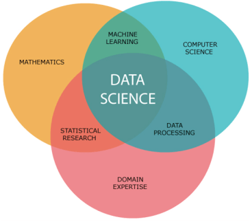
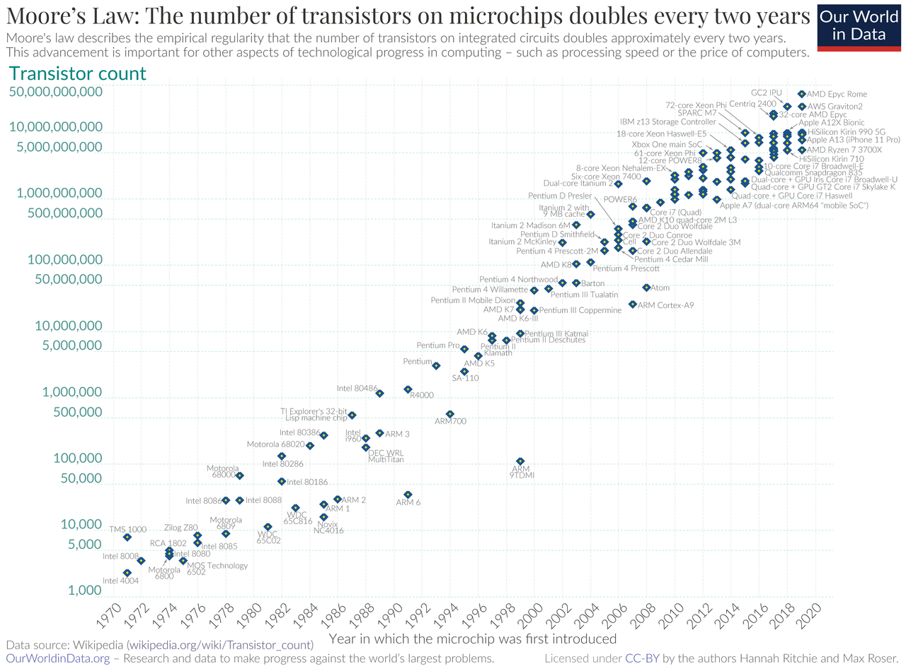
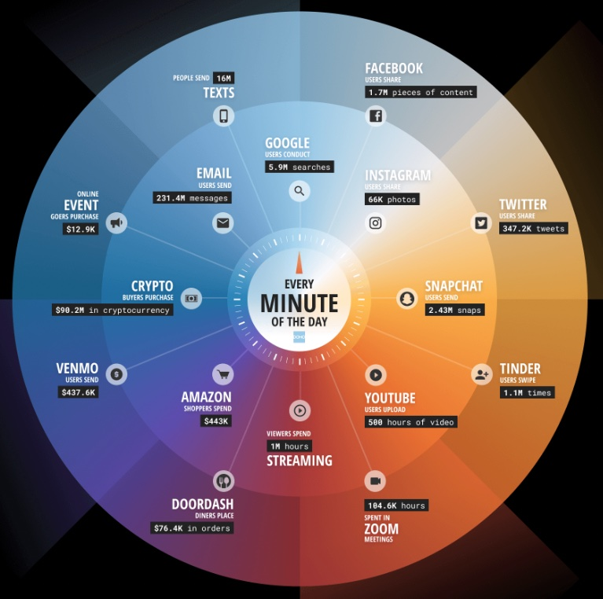

---
title: "Applied Geographical Data Science (GE3259)"
author: "Dr. Sudatta Ray and Dr. Gopal Penny"
date: "2022-12-29"
output: powerpoint_presentation
   
--- 

```{css, echo=FALSE}
p {
  font-size: 32px;
}

.fullslide img {
  margin-top: -85px;
  margin-left: -0px;
}

```


```{r setup, include=FALSE}
knitr::opts_chunk$set(echo = FALSE)
```


## Outline for today

* Syllabus
* What is data science?
* Goals for the class
* Introduction to `R` and RStudio

## Syllabus

Please review the syllabus

## What is data science?

<div class='columns-2'>

* Field of study that focuses on managing and analyzing data.
* More commonly a practical approach to extract meaning and insights from data
* Toolset including programming, statistics, data storage, visualization, and communication




<!-- https://medium.com/analytics-vidhya/introduction-to-data-science-28deb32878e7 -->

</div>

## Why do we need data science?

* Data contains information about the world - we need to extract and interpret this information.
* Data analysis is the basis for understanding cause-and-effect relationships for processes we cannot easily observe/test.
* Large datasets carry vast amounts of information ([The unreasonable effectiveness of data - Google Research](https://static.googleusercontent.com/media/research.google.com/en//pubs/archive/35179.pdf))

## Why is data science gaining influence?

* Increasing computing power (i.e., Moore's law)
  + More transistors on computer chips allows faster processing of bigger datasets
* Increasing availability of data from (e.g.):
  + Consumers, social media users
  + Crowd sourcing
  + Artificial intelligence (AI)
  + Government agencies
  + Satellites
* New algorithms for data processing
  + Faster and better processing of large datasets
  + New tools in AI. The "intelligence" of machines comes from data
  
<!-- https://braincube.com/resource/manufacturing-ai-vs-machine-learning-vs-data-science/ -->

```{css, echo = FALSE}

.moores img {
  margin-top: -85px;
  margin-left: -0px;
}

```

## {.moores}

{width=95%}


## Data never sleeps {data-background="images/data-never-sleeps-10.0.jpg"}

[source: Domo](https://www.domo.com/data-never-sleeps)

## {data-background="images/ai-vs-ds.png"}

## {data-background="images/big-five-personality.png"}

https://blog.adioma.com/5-personality-traits-infographic/

## Your computer knows you better than your friends do, say researchers

[The Guardian](https://www.theguardian.com/technology/2015/jan/13/your-computer-knows-you-researchers-cambridge-stanford-university)

"The researchers found that their software was able to predict a study participant’s personality more accurately than a work colleague by analysing just 10 [Facebook] likes.

"Inputting 70 Likes allowed it to obtain a truer picture of someone’s character than a friend or flatmate, while 150 likes out-performed a parent or sibling. It took 300 likes before the programme was able to judge character better than a spouse."

## How could this be used?

{width=50%}

<!-- https://www.theguardian.com/uk-news/2018/mar/23/leaked-cambridge-analyticas-blueprint-for-trump-victory -->

## The data science process

Three stages:

* Data wrangling (import & tidy)
* Data analysis (transform, visualize, model)
* Communication


## Programming in `R`

* Open source -- all code fully available for free
* Supported by package development -- anyone can contribute packages!
* Statistical computing and analysis
* Full-time developers at RStudio have created an excellent environment for data science

<!-- * It is a "functional" programming language -->
<!--   + This means functions are at the core of R operations -->

<!-- ```{r echo = TRUE} -->
<!-- print("hello world") -->
<!-- ``` -->
  

## Programming languages: `python` vs `R`

`python` and `R` are generally considered the most popular multi-purpose languages for programming

## Challenges you will face

* Conceptual
  + Programming
  + Math
  + Data wrangling
* Language
  + `R`

## Tips for success

* Regular practice
  + Reviewing material
  + Completing assignments
  + 3+ days per week
  + Discuss material with peers & instructors

## Stuff

# END OF SLIDES

  
## {.fullslide}

{width=70%}
  
## Data never sleeps (domo.com)

<!-- <div class="columns-2"> -->

{width=100%}

* We generate massive amounts of data online
* Too much data to view it all

<!-- </div> -->

## Big data vs small data


## Questions to ask

Has something increased?
What is the biggest driver?
How much data do I need?
How did this variable change over time?

How will 

## What will we cover?

Syllabus

## Why is it important?

## Data science landscape

* Why `R`?

## Slide with R Output

```{r cars, echo = TRUE}
summary(cars)
```

## Slide with Plot

```{r pressure}
plot(pressure)
```

