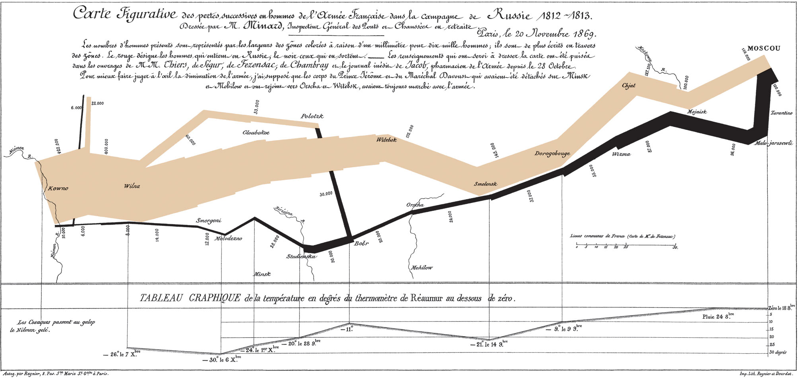

```{r xaringan-themerx, include=FALSE, warning=FALSE}

library(xaringanthemer)
style_mono_accent(
  base_color = "#1c5253",
  header_font_google = google_font("Josefin Sans"),
  text_font_google   = google_font("Montserrat", "300", "300i"),
  code_font_google   = google_font("Fira Mono")
)

extra_css <- list(
  ".small .remark-code" = list("font-size" = "70%"),
  # ".remark-code" = list("font-size" = "60%"),
  ".full-width" = list(
    display = "flex",
    width   = "100%",
    flex    = "1 1 auto"
  )
)
style_extra_css(css = extra_css)

knitr::opts_chunk$set(fig.retina = 3)

# xaringan::inf_mr()
```


<!-- https://arm.rbind.io/slides/xaringan.html#1 -->

# Learning objectives

- Understand the key elements of data science:

  - Import, tidy, explore, communicate

- Import tabular data from csv and excel files

- Understand the key elements of grammar of graphics:

- Apply the grammar of graphics to make visualizations with `ggplot2`

---

# Key elements of data science

.pull-left[
**Import:** load data into `R` from CSV or Excel files

**Tidy:** real-world data is often messy and must be cleaned prior to analysis

**Understand**

]

.pull-right[
.center[]
.center[The data science process (*R for Data Science*)]

]

- *Transform:* filter data for subsets, create new variables.
- *Visualize:* essential for understanding the data and developing insights
- *Model:* computational and statistical tools to analyze the data

**Communicate:** prepare & disseminate reports, blogs, etc.


---

# *Import* data to `R`

```{r include = FALSE}
# prepare files
readr::write_csv(iris, 'Week 4 data/iris.csv')
xlsx::write.xlsx(iris, 'Week 4 data/iris.xlsx', row.names = FALSE)
```

.pull-left[
- Importing data allows us to begin analysis
- Data often available in csv or excel format
- `R` has built-in functions for reading data, but these are slightly cumbersome
- Instead, we will use functions from the `readr` (for csv) and `readxl` (for excel) packages
]

---

# *Import* csv to `R`

Let's say we want to import the following .csv file to `R`.

.center[]
.center[Data in `Week 4 data/table_example.csv`]

Note that the file is in a subdirectory of the working directory:

```{r highlight.output=c(2)}
list.files("Week 4 data")
```

---

# *Import* csv to `R`


We can import the .csv from using the `readr` and code below.
Note that you may need to run `install.packages('readr')` if you haven't already.


```{r echo = TRUE, message = FALSE}
library(readr) 

table <- read_csv('Week 4 data/iris.csv')
print(table)
```


---

# *Import* excel to `R`

In excel format.
.center[]
.center[Data in `Week 4 data/table_example.xlsx`]

Again, the file is in a subdirectory of the working directory:

```{r highlight.output=c(2)}
list.files("Week 4 data")
```

---

# *Import* excel to `R`


We can import the .xlsx using the `readxl` package.
You may need to run `install.packages('readxl')` if you haven't already.


```{r echo = TRUE, message = FALSE}
library(readxl) 

table_excel <- read_excel('Week 4 data/iris.xlsx')
print(table_excel)
```

---

# The `iris` dataset


The `iris` dataset (from previous slide) is common for code demonstrations. It documents properties of individual flowers from different species

.center[

Image from: https://www.datacamp.com/tutorial/machine-learning-in-r
]

---

# Visualizing the data

Data visualization is an essential component of data science! We use visualization to:

- Understand what is in the data set
- Develop intuition for relationships in the data *before* we analyze it
- Ensure our analyses are yielding reasonable results
- Communicate important findings

When we get a new dataset, we should usually follow two critical steps:

1. Make sure we can import the data (*import the data*)
2. Make sure the data contain the information we expect (use `summary()` function)
3. Begin to visualize the data (either with `ggplot` or `GGally`, the latter of which we will cover later)

---

# The `iris` dataset

```{r echo = TRUE}
summary(iris)
```

From the `summary` output, we see that there are 4 columns of continuous variables and one column for a discrete variable. The dicrete variable has 3 categories each with 50 observations.

---

# Visualizing the data

Next we want to visualize the data. For now we will consider only 2 variables, `Petal.Length` vs `Petal.Width`.

```{r iris-plot, fig.width = 6, fig.height = 4, fig.show='hide'}
library(ggplot2)
iris_plot = ggplot(data = iris) +
  geom_point(aes(x = Petal.Width, y = Petal.Length, color = Species))
iris_plot
```

.pull-left[
```{r echo = FALSE, fig.width = 6, fig.height = 4}
iris_plot
```
]

--

.pull-right[

### Plots in R can be built via the *Grammar of Graphics* with `ggplot`

]

???

My first slide notes

---

# A grammar of graphics

- Structured way to think about data visualization:

.center[

```{r echo = FALSE, out.width = '75%'}

```

]
Graphics objects produced by: 

- (left) **geometric objects** - e.g., points, lines, bars
- (middle) **scales and coordinate system** - scales can include shapes, colors, and other aesthetic mappings
- (right) **plot annotations**.<sup>1</sup>

.footnote[[1] Wickham, 2010. A layered grammar of graphics.]

???

- Different from most programming languages -- e..g. scatterplot, barplot
- Note the shape scale present on left

---

# A grammar of graphics

.pull-left[
Combining these elements produces the following figure:

.center[
```{r echo = FALSE, out.width = '90%'}

```
]
]

.pull-right[

The figure is created from the following dataset. Note that the geometric objects are points. The aesthetic mapping includes `A` and `C` columns mapped to the x-y coordinate system, and the `Shape` column mapped to the shape aesthetic.

```{r echo = FALSE, out.width = '90%'}
df = data.frame(A = c(25, 0, 75, 200),
                C = c(11, 0, 53, 300),
                Shape = c("circle", "circle", "square", "square"))
print(df)
```
]

.footnote[[1] Wickham, 2010. A layered grammar of graphics.]

---

# Plotting in R: `ggplot2`

In `R`, the `ggplot2` package implements the Grammar of Graphics. We can see this via the same code as before.

```{r include = FALSE}
# https://irene.vrbik.ok.ubc.ca/slides/NHSRxaringan.html?panelset1=tab-12#24
```

```{r ggcode-intro, tidy=FALSE, fig.show='hide', eval=FALSE}
library(ggplot2)
iris_plot = ggplot(data = iris) + #<<
  geom_point(aes(x = Petal.Width, y = Petal.Length, color = Species))
```

We initialize the `ggplot` object with a default dataset, in this case `iris` (see highlighted code). Note that the line ends with a `+` which means that `R` will interpret the next line of text as a continuation of this line of code.

---

# Plotting in R: `ggplot2`

In `R`, the `ggplot2` package implements the Grammar of Graphics. We can see this via the same code as before.

```{r tidy=FALSE, fig.show='hide', eval=FALSE}
library(ggplot2)
iris_plot = ggplot(data = iris) +
  geom_point(aes(x = Petal.Width, y = Petal.Length, color = Species)) #<<
```

The next line builds the geometric objects, coordinate system, and aesthetics.

- `geom_point()` means that our geometric objects will be points
- The `aes()` function defines aesthetic mapping of columns to various scales (including the coordinate system):
  - `x = Petal.Width` indicates the column that will map to the x-axis
  - `y = Petal.Length` indicates the column that will map to the y-axis
  - `color = Species` indicates the column that will map to color scale

---

# Another `ggplot` example

Give example of ggplot with timeseries data using geom_line, geom_point, shape scale, size scale.

---

# Explain code in example

STUFF

---

# Geometric objects in ggplot


```{r fig.height=14, fig.width = 14, include = FALSE}
library(dplyr)
# GGally::ggpairs(mpg %>% select(-model))
```

(not exhaustive)

geom_point
geom_line
geom_bar
geom_text
geom_path
geom_polygon
geom_segment
geom_ribbon

Note that each geometric type has the requirement that aesthetics map to the coordinate system. Usually this includes x-y aesthetics, but may also include, for example, `label` (`geom_text`), `ymin` and `ymax` (`geom_ribbon`), etc.

---

# Aesthetic scales in ggplot

All aesthetics include a mapping (e.g. column `A` to shape) and a scale (which shapes correspond to which values).

The mapping is specified in the `aes()` function, either as a defult for the figure or within the specific geometric layer.

The scale can be taken as the default for the aesthetic and data type, or specified in a separate function.

x - `scale_x_continuous`, `scale_x_discrete`, `scale_x_manual`
y - `scale_y_continuous`, `scale_y_discrete`, `scale_y_manual`
color - `scale_color_continuous`, `scale_color_discrete`, `scale_color_manual`
fill - `scale_fill_continuous`, `scale_fill_discrete`, `scale_fill_manual`
size - `scale_size_continuous`, `scale_size_discrete`, `scale_size_manual`
shape - `scale_shape_discrete`, `scale_shape_manual`
linetype
label (text)
alpha (transparency)


---

# Syntax of `ggplot2`

Note that because `ggplot2` builds plots in a layered fashion, we can use a variety of syntax styles.

Here, we put the dataset inside the `geom_point()` object:

```{r ggcode-syntax1, tidy=FALSE, fig.show='hide', eval=FALSE}
ggplot() + 
  geom_point(
    data = iris, #<<
    aes(x = Petal.Width, y = Petal.Length, color = Species))
```

Alternatively, we can put the `aes()` object inside the `ggplot()` function to set default aesthetics:

```{r ggcode-syntax2, tidy=FALSE, fig.show='hide', eval=FALSE}
ggplot(data = iris, 
       aes(x = Petal.Width, y = Petal.Length, color = Species)) + #<<
  geom_point()
```

Each of these generates the same plot!

---

# Napoleon's march on Russia

Famous depiction of the march by Charles Joseph Minard.

```{r out.width = '100%', echo = FALSE}

```

???

Begin with 422k, end with 1k
Cold temperatures - depictions & stories of men freezing on side of road
Elegant and minimal 

---


# Napoleon's march on Russia

We can reproduce a version of Minard's map using `ggplot`. First we need the data, which is available online.

```{r message = FALSE, fig.width = 10, fig.height = 3.5}
cities_url = "https://raw.githubusercontent.com/stdlib-js/datasets-minard-napoleons-march/main/data/cities.csv"
cities = read_csv(cities_url)
armies_url = "https://raw.githubusercontent.com/stdlib-js/datasets-minard-napoleons-march/main/data/army.csv"
armies = read_csv(armies_url)
```

.small[
.pull-left[
```{r}
armies
```
]

.pull-right[
```{r}
cities[1:10,]
```
]
]

---


# Napoleon's march on Russia

Reproduction of the march by Charles Joseph Minard. Start with `geom_point`.

```{r message = FALSE, fig.width = 10, fig.height = 3.5}
ggplot(armies) + #<<
  geom_point(aes(lon, lat, size = size)) #<<
```


---


# Napoleon's march on Russia

Add `color = direction`

```{r message = FALSE, fig.width = 10, fig.height = 3.5}
ggplot(armies) +
  geom_point(aes(lon, lat, size = size, color = direction)) #<<
```

---


# Napoleon's march on Russia

Add `geom_text` to include cities.

```{r message = FALSE, fig.width = 10, fig.height = 3.5}
ggplot(armies) +
  geom_point(aes(lon, lat, size = size, color = direction)) +
  geom_text(data = cities, aes(x = lon, y = lat, label = city)) #<<
```

`geom_text` takes `x` and `y` arguments in addition to a `label` argument which contains the text.

---


# Napoleon's march on Russia

Switch from `geom_point` to `geom_path`

```{r message = FALSE, fig.width = 10, fig.height = 3.5}
ggplot(armies) +
  geom_path(aes(lon, lat, size = size, color = direction)) + #<<
  geom_text(data = cities, aes(x = lon, y = lat, label = city))
```

Note that `geom_path` plots a path in the order given by the `data.frame`, while respecting categorical grouping given by aesthetics (in this case, `color = direction`). But each path should follow each division separately. 

---


# Napoleon's march on Russia

Better with `group = division` so each division follows its own path. 

```{r message = FALSE, fig.width = 10, fig.height = 3.5}
ggplot(armies) +
  geom_path(aes(lon, lat, size = size, color = direction, 
                group = division), lineend = 'round') + #<<
  geom_text(data = cities, aes(x = lon, y = lat, label = city))
```

Using `lineend = 'round'` helps visually by connecting the points along the path with rounded nodes.

---


# Napoleon's march on Russia

We can also use `scale_size_continous` to make the legend more readable.

```{r message = FALSE, fig.width = 10, fig.height = 3.5}
ggplot(armies) +
  geom_path(aes(lon, lat, size = size, color = direction, 
                group = division), lineend = 'round') +
  geom_text(data = cities, aes(x = lon, y = lat, label = city)) +
  scale_size_continuous(breaks = c(5e3, 2e4, 5e4, 2e5), #<<
                        labels = c("5k", "20k", "50k", "200k"), #<<
                        range = c(0.5, 8)) # specifies min, max size #<<
```

---


# Napoleon's march on Russia

Finally, we can add a `theme` object.

```{r message = FALSE, fig.width = 10, fig.height = 3.5}
ggplot(armies) +
  geom_path(aes(lon, lat, size = size, color = direction, 
                group = division), lineend = 'round') +
  geom_text(data = cities, aes(x = lon, y = lat, label = city)) +
  scale_size_continuous(breaks = c(5e3, 2e4, 5e4, 2e5), 
                        labels = c("5k", "20k", "50k", "200k"), 
                        range = c(0.5, 8)) +
  scale_color_manual(values = c("tan", 'darkgray'))  #<<
```

---


# Napoleon's march on Russia

Finally, we can add a `theme` object.

```{r message = FALSE, fig.width = 10, fig.height = 3.5}
ggplot(armies) +
  geom_path(aes(lon, lat, size = size, color = direction, 
                group = division), lineend = 'round') +
  geom_text(data = cities, aes(x = lon, y = lat, label = city)) +
  scale_size_continuous(breaks = c(5e3, 2e4, 5e4, 2e5), 
                        labels = c("5k", "20k", "50k", "200k"), 
                        range = c(0.5, 8)) +
  scale_color_manual(values = c("tan", 'darkgray')) +
  ggtitle("Napoleon's march on Russia") + theme_bw() #<<
```

---

## Specifiying the legend scale for size

`scale_size_continuous` includes the following key arguments:

- `breaks` indicate which sizes should be shown
- `labels` provide the text for each of the `breaks`
- `range` controls the actual size of the linewidth

---


# Outline of remaining slides

- Additional timeseries dataset
- long format data
- `scale_size_*`
- `scale_color_*`, `scale_fill_*`
- `scale_linetype_*`
- `scale_x_*`, `scale_y_*`
- `scale_shape_*`
- `geom_bar`
- `geom_line`
- `geom_text`
- `facet_wrap`
- `theme`
- In-class activity - plotting data


