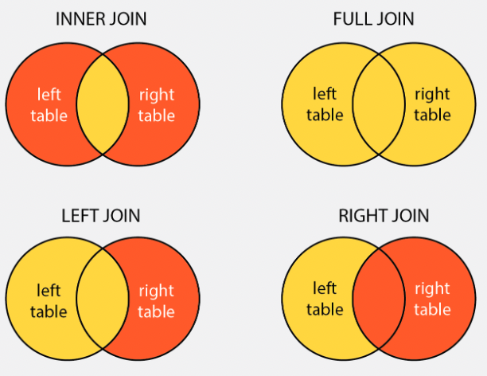

```{r xaringan-themerx2, include=FALSE, warning=FALSE}

library(xaringanthemer)
style_mono_accent(
  base_color = "#1c5253",
  header_font_google = google_font("Josefin Sans"),
  text_font_google   = google_font("Montserrat", "300", "300i"),
  code_font_google   = google_font("Fira Mono")
)

extra_css <- list(
  ".small .remark-code" = list("font-size" = "70%"),
  # ".remark-code" = list("font-size" = "60%"),
  ".full-width" = list(
    display = "flex",
    width   = "100%",
    flex    = "1 1 auto"
  )
)
style_extra_css(css = extra_css)

knitr::opts_chunk$set(fig.retina = 3)

# xaringan::inf_mr()
```


```{r, echo = FALSE, results=FALSE, message = FALSE, warning = FALSE}
# Packages

library(dplyr)
```


<!-- https://arm.rbind.io/slides/xaringan.html#1 -->

# Learning objectives

- Ability to prepare datasets for analysis

  - Import, reshape, and clean

- Ability to reshape data between wide and long formats

- Working with relational data (multiple tables linked by a key)

- Process strings using regular expressions

---

# Reshape data between wide and long formats

Two formats for tabular data:

- Wide format
- Long format

https://www.statology.org/long-vs-wide-data/

---

# Relational data

Sometimes we have data in multiple tables that must be joined into a single table.

The data are related by a column in each table containing a key that matches the two 
tables.

.pull-left[
`precip`

```{r, echo = FALSE}
precip <- tibble::tribble(~Gauge, ~Date, ~Precipitation,
                        "Gauge 1", "2020-01-01", "10 mm",
                        "Gauge 1", "2020-01-02", "3 mm",
                        "Gauge 2", "2020-01-01", "0 mm",
                        "Gauge 2", "2020-01-02", "5 mm")
knitr::kable(precip)
```
]

.pull-right[
`gauges`

```{r, echo = FALSE}
gauges <- tibble::tribble(~Gauge, ~Latitude, ~Longitude,
                             "Gauge 1", 1.322, 75.234,
                             "Gauge 2", 5.870, 97.972)
knitr::kable(gauges)
```
]

---

# The joined result

```{r, echo = FALSE}
joined <- left_join(precip, gauges, by = "Gauge")
knitr::kable(joined)
```


---

# Types of joins

The rows from the original two tables that are kept in the resulting table depend
on the type of join.

.center[]
.center[www.golinuxcloud.com]
<!-- https://www.golinuxcloud.com/sql-left-outer-join-examples/ -->


